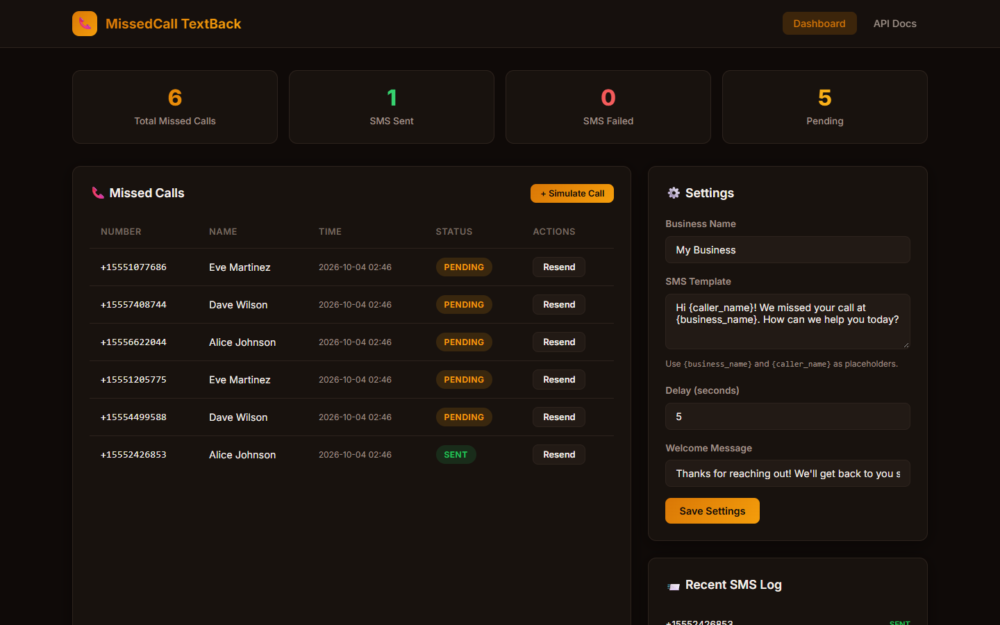
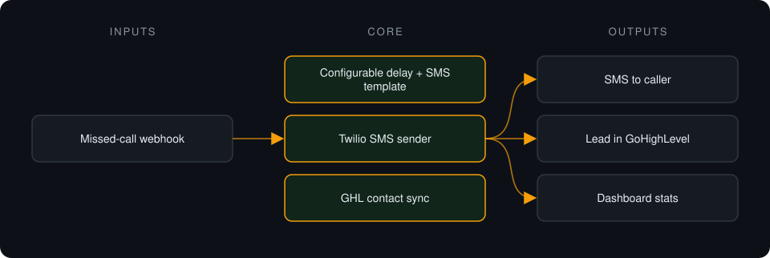
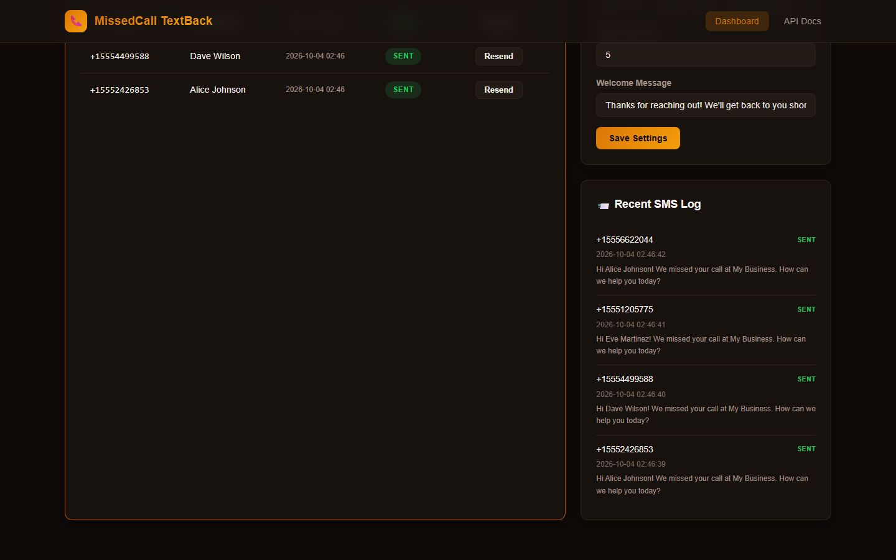

# GHL Missed-Call Text-Back

**Detects missed calls, texts the caller back within seconds and logs the lead in GoHighLevel.**

> **This is a proprietary project. Source code is private. This page showcases the system's architecture and results.**

**Case study page:** [https://jryahia.github.io/showcase-ghl-missed-call-textback/](https://jryahia.github.io/showcase-ghl-missed-call-textback/)

## Problem it solves

For service businesses a missed call is often a lost job, because the caller simply rings the next company. This system replies by SMS automatically so the conversation keeps going.

## Architecture

1. The phone system reports a missed call via webhook.
2. After a configurable delay, a templated SMS is sent to the caller.
3. The caller is created as a contact in GoHighLevel.
4. Delivery status and success rate appear on the dashboard.

## Key features

- Missed-call webhook receiver
- Editable SMS template and delay
- Twilio delivery with a demo simulator
- GoHighLevel contact creation
- Missed calls list and delivery stats

## Tech stack

     

## What it does in practice

- Every missed call gets a reply without anyone watching the phone log.

## Screenshots

**Missed calls, SMS status and settings**

**Recent SMS log**

---

Built by [Yahya Jarray](https://github.com/jryahia). Interested in a similar system? [Get in touch](mailto:yahiajarray43@gmail.com).

This repository contains no source code. It is a case study for a proprietary project. © Yahya Jarray.
